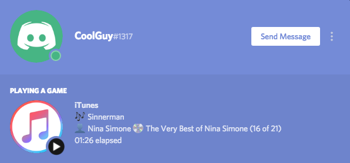
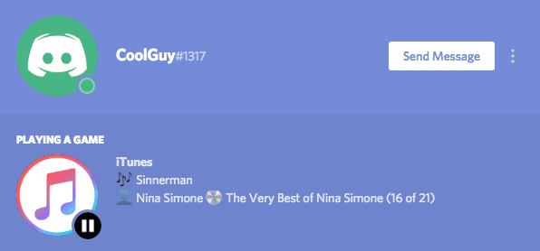
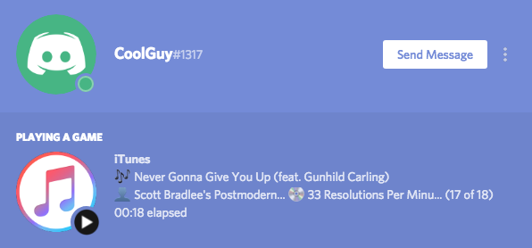

# iTunes Rich Presence for Discord
This is an application that lets you have a personalized Discord status based on what you're listening to on iTunes. The status will show the song name, artist, album name, time elapsed since the track started playing and index of the track in the album. Additionally, an image with a "playing" or "paused" button will be shown in case the track is playing or paused. For some examples, see the [screenshots](#screenshots).

## Features
* Simple to use.
* No in-app login required.
* Lightweight (~1.5MB file).
* Works on both MacOS and Windows.
* Ugly UI.

## Requirements
* **MacOS** / **Windows**.
* A Java Runtime Environment (**JRE**), minimum version **1.8** (you can download it from [here](https://java.com/download/)).
* [iTunes](https://www.apple.com/itunes/download/) and [Discord](https://discordapp.com/download) applications.
* For **Windows** users: this application should work for iTunes version 4.7 or later.

## Usage
* Download the application as:
  * [*jar*](https://github.com/kevinmussi/iTunes-Discord-RP/releases/download/v1.1/iTunesDiscordRP-1.1.jar): it can be run on either OS.
  * [*dmg*](https://github.com/kevinmussi/iTunes-Discord-RP/releases/download/v1.1/iTunesDiscordRP-1.1.dmg): image that contains the *.app* bundle that can be run on **MacOS** as a native application (double click on the .dmg file, then extract the .app file to wherever you want).
  * [*exe*](https://github.com/kevinmussi/iTunes-Discord-RP/releases/download/v1.1/iTunesDiscordRP.exe): executable that can be run on **Windows** as a native application.
* Double click on it.
* For **Mac** users: the first time you try to launch the app, it can happen that MacOS doesn't let you. If that's the case, you must open the file by right-clicking it, selecting "Open" and then selecting "Open" again on the dialog that appears (this must be done only once).
* Done!

## Screenshots
### Status preview

### Status while playing

### Status while paused

### Status with long names

## To-dos
* Javadocs.
* Unit tests.
* Spotify integration (easy but rather useless).
* Command line only interface.
* Allow customization of the rich presence elements.
* Make it a menu bar app for MacOS.

## Acknowledgements
* [DiscordIPC](https://github.com/jagrosh/DiscordIPC) by @jagrosh.

## Disclaimer
iTunes is a trademark of Apple Inc., registered in the U.S. and other countries.\
This application has not been authorized, sponsored, or otherwise approved by Apple Inc.
